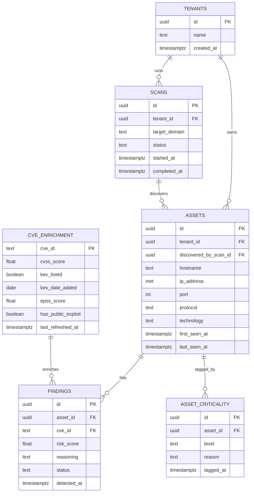

# Cerberus — Database Schema

**Store:** PostgreSQL (primary), Redis (cache/queue only — not modeled here)

## 1. Design rationale

- **Enrichment data is global.** `cve_enrichment` is keyed by CVE ID only, not by tenant or scan — it's a shared cache refreshed on a schedule, per the [design principles](../README.md#design-principles). This avoids re-fetching the same NVD/KEV/EPSS record for every organization that happens to have the same vulnerable software.
- **Findings, not assets, carry the risk score.** The same CVE on two different assets can have different scores because asset criticality and exposure context differ — so `risk_score` and `reasoning` live on `findings`, not on `cve_enrichment`.
- **Scans are immutable snapshots.** Each `scans` row represents one pipeline run; `assets` and `findings` reference the scan that (re-)discovered them, so history isn't destroyed on re-scan — a row is updated in place only for `last_seen_at`, everything else is append-friendly.
- **Tenant scoping exists from day one** even though v1 is single-operator, because retrofitting a `tenant_id` column onto every table later is far more disruptive than including it now and defaulting to a single row.

## 2. Entity-Relationship Diagram

## 3. Table Reference

### `tenants`
Single row for v1 (see [PRD §3, Non-Goals](PRD.md#3-non-goals-v1)). Kept for forward compatibility with multi-tenant SaaS.

| Column | Type | Notes |
|---|---|---|
| `id` | uuid, PK | |
| `name` | text | |
| `created_at` | timestamptz | |

### `scans`
One row per pipeline run. Status tracks progress through discovery → ingestion → enrichment → scoring.

| Column | Type | Notes |
|---|---|---|
| `id` | uuid, PK | |
| `tenant_id` | uuid, FK → tenants.id | |
| `target_domain` | text | the domain passed to `cerberus scan --target` |
| `status` | text | `pending` \| `discovering` \| `enriching` \| `scoring` \| `completed` \| `failed` |
| `started_at` | timestamptz | |
| `completed_at` | timestamptz, nullable | |

### `assets`
One row per discovered `host:port` combination. Re-discovering the same asset updates `last_seen_at` rather than inserting a duplicate (see [PRD §5.2 acceptance criteria](PRD.md#52-ingestion--normalization)).

| Column | Type | Notes |
|---|---|---|
| `id` | uuid, PK | |
| `tenant_id` | uuid, FK → tenants.id | |
| `discovered_by_scan_id` | uuid, FK → scans.id | the scan that first found this asset |
| `hostname` | text | |
| `ip_address` | inet | |
| `port` | int | |
| `protocol` | text | `tcp` \| `udp` |
| `technology` | text, nullable | e.g. `nginx/1.24`, from httpx fingerprinting |
| `first_seen_at` | timestamptz | |
| `last_seen_at` | timestamptz | updated on every re-scan that still finds this asset |

Unique constraint: `(tenant_id, hostname, port, protocol)`.

### `asset_criticality`
Manual or heuristic tagging of an asset's business importance. Feeds the `asset_criticality` weight in [config.yaml](../config.yaml).

| Column | Type | Notes |
|---|---|---|
| `id` | uuid, PK | |
| `asset_id` | uuid, FK → assets.id | |
| `level` | text | `low` \| `medium` \| `high` \| `critical` |
| `reason` | text, nullable | e.g. "matches prod-* naming convention", or a human note |
| `tagged_at` | timestamptz | |

### `cve_enrichment`
Global cache, keyed by CVE ID — not tenant-scoped. Refreshed by `scripts/refresh_enrichment.py` on the interval set in [config.yaml](../config.yaml).

| Column | Type | Notes |
|---|---|---|
| `cve_id` | text, PK | e.g. `CVE-2023-XXXXX` |
| `cvss_score` | float | from NVD |
| `kev_listed` | boolean | from CISA KEV |
| `kev_date_added` | date, nullable | |
| `epss_score` | float | 0–1, from FIRST.org EPSS |
| `has_public_exploit` | boolean | cross-referenced against Exploit-DB |
| `last_refreshed_at` | timestamptz | |

### `findings`
The join between a specific asset and a specific CVE, carrying the computed risk score. This is what the [API](API.md#get-apiv1findings) serves.

| Column | Type | Notes |
|---|---|---|
| `id` | uuid, PK | |
| `asset_id` | uuid, FK → assets.id | |
| `cve_id` | text, FK → cve_enrichment.cve_id | |
| `risk_score` | float, nullable | populated by the scoring engine; null until scored |
| `reasoning` | text, nullable | human-readable explanation, populated with `risk_score` |
| `status` | text | `open` \| `acknowledged` \| `resolved` \| `false_positive` |
| `detected_at` | timestamptz | |

Unique constraint: `(asset_id, cve_id)` — re-detecting the same CVE on the same asset updates the existing row rather than duplicating it.

## 4. Indexes (v1)

- `findings (risk_score DESC)` — supports `GET /api/v1/findings?sort=risk_score`
- `findings (cve_id)` — supports the join to `cve_enrichment`
- `assets (tenant_id)`, `findings (asset_id)` — tenant/asset scoping on every list query
