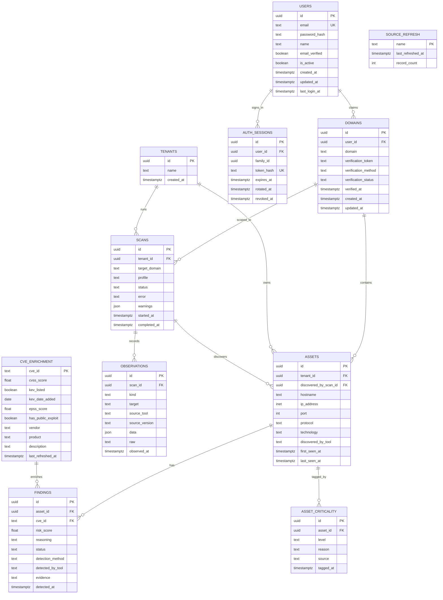

# Cerberus — Database Schema

**Store:** PostgreSQL in production; SQLite for local development (same models, see §5).

## 1. Design rationale

- **Enrichment data is global.** `cve_enrichment` is keyed by CVE ID only, not by tenant or scan — it's a shared cache refreshed on a schedule, per the [design principles](../README.md#design-principles). This avoids re-fetching the same NVD/KEV/EPSS record for every organization that happens to have the same vulnerable software.
- **Findings, not assets, carry the risk score.** The same CVE on two different assets can have different scores because asset criticality and exposure context differ — so `risk_score` and `reasoning` live on `findings`, not on `cve_enrichment`.
- **Scans are immutable snapshots.** Each `scans` row represents one pipeline run; `assets` and `findings` reference the scan that (re-)discovered them, so history isn't destroyed on re-scan — a row is updated in place only for `last_seen_at`, everything else is append-friendly.
- **Ownership is user → domain → scan.** A scan belongs to a *verified* domain owned by the user who ran it (`core/ownership.py`: owns it, it is verified, the target is inside it). The `tenants` table is legacy during the move and is not removed yet.
- **Tenant scoping exists from day one** even though v1 is single-operator, because retrofitting a `tenant_id` column onto every table later is far more disruptive than including it now and defaulting to a single row.

## 2. Entity-Relationship Diagram

## 3. Table Reference

### `tenants`
Single row for v1 (see [PRD §3, Non-Goals](PRD.md#3-non-goals-v1)). Kept for forward compatibility with multi-tenant SaaS.

| Column | Type | Notes |
|---|---|---|
| `id` | uuid, PK | |
| `name` | text | |
| `created_at` | timestamptz | |

### `users`
A person who signs in. Authentication (passwords, sessions) lives at the API boundary; the scanning pipeline never sees it, only the ownership this table establishes.

| Column | Type | Notes |
|---|---|---|
| `id` | uuid, PK | |
| `email` | text, **unique** | stored lower-case (`normalize_email`), so `A@x.com` and `a@x.com` are one account |
| `password_hash` | text | a slow-KDF hash, never the password |
| `name` | text | |
| `email_verified` | boolean | default `false` |
| `is_active` | boolean | default `true`; a disabled account cannot scan |
| `created_at`, `updated_at` | timestamptz | |
| `last_login_at` | timestamptz, nullable | |

### `auth_sessions`
One refresh token, server side. A sign-in starts a **family**; each refresh adds a row to the same family and marks the previous one `rotated_at`. Signing out (or detecting a replay) sets `revoked_at` across the family.

| Column | Type | Notes |
|---|---|---|
| `id` | uuid, PK | |
| `user_id` | uuid, FK → users.id | |
| `family_id` | uuid | one per sign-in; rotation keeps it |
| `token_hash` | text, **unique** | SHA-256 of the token. The token itself is never stored, so a copy of this table cannot mint a session |
| `created_at`, `expires_at` | timestamptz | |
| `rotated_at` | timestamptz, nullable | used and replaced (normal). A 10-second leeway forgives two tabs refreshing at once |
| `revoked_at` | timestamptz, nullable | the login was ended. Final, no leeway |

Rows whose `expires_at` passed more than a day ago are deleted at API startup.

### `domains`
A domain a user says they own. It can be scanned only once **verified**.

| Column | Type | Notes |
|---|---|---|
| `id` | uuid, PK | |
| `user_id` | uuid, FK → users.id | the claimant |
| `domain` | text | stored normalised (`normalize_domain`): lower-case, no scheme, path, port or trailing dot; IP addresses and wildcards are refused |
| `verification_token` | text | unguessable value the owner publishes to prove control |
| `verification_method` | text | `dns_txt` (default) \| `http_file` |
| `verification_status` | text | `pending` (default) \| `verified` \| `failed` |
| `verified_at` | timestamptz, nullable | |
| `created_at`, `updated_at` | timestamptz | |

Verification is a DNS TXT record: the owner publishes `_cerberus-challenge.<domain>  TXT  "cerberus-verify=<token>"`, and `POST /api/v1/domains/{id}/verify` looks it up (`core/verification.py`).

Constraints: `(user_id, domain)` is unique, so a user cannot claim a domain twice. **Claims are not unique, proof is:** a partial unique index (`uq_domain_one_verified_owner`, `WHERE verification_status = 'verified'`) means anyone may *claim* any domain, but only one user can hold it *verified*. Whoever proves control first owns it, and a domain can move to someone else only after the first owner's status leaves `verified`.

### `scans`
One row per pipeline run. Status tracks progress through discovery → ingestion → enrichment → scoring.

| Column | Type | Notes |
|---|---|---|
| `id` | uuid, PK | |
| `tenant_id` | uuid, FK → tenants.id | legacy scoping; kept until the tenant model is retired |
| `user_id` | uuid, FK → users.id, nullable | who ran it. `NULL` on rows written before users existed |
| `domain_id` | uuid, FK → domains.id, nullable | the verified domain the scan was authorised under |
| `target_domain` | text | the domain passed to `cerberus scan --target` |
| `profile` | text | the scan profile that governed the run (`passive` \| `safe` \| `thorough`) — the record of what was permitted |
| `status` | text | `pending` \| `discovering` \| `enriching` \| `scoring` \| `completed` \| `failed` |
| `error` | text, nullable | failure reason when `status` is `failed` |
| `warnings` | json | non-fatal problems: a scanner that failed to run, a stale enrichment cache. A scan can complete and still have been degraded |
| `started_at` | timestamptz | |
| `completed_at` | timestamptz, nullable | |

### `assets`
One row per discovered `host:port` combination. Re-discovering the same asset updates `last_seen_at` rather than inserting a duplicate (see [PRD §5.2 acceptance criteria](PRD.md#52-ingestion--normalization)).

| Column | Type | Notes |
|---|---|---|
| `id` | uuid, PK | |
| `tenant_id` | uuid, FK → tenants.id | |
| `user_id` | uuid, FK → users.id, nullable | owner; `NULL` on legacy rows. **Part of asset identity**: an asset is one `host:port` *per owner*, so two users may each hold `api.example.com:443` without seeing or overwriting each other's row (partial unique indexes `uq_asset_identity_owned` / `uq_asset_identity_legacy`) |
| `domain_id` | uuid, FK → domains.id, nullable | the domain this asset belongs to; `NULL` on legacy rows |
| `discovered_by_scan_id` | uuid, FK → scans.id | the scan that first found this asset |
| `hostname` | text | |
| `ip_address` | inet | |
| `port` | int | |
| `protocol` | text | `tcp` \| `udp` |
| `technology` | text, nullable | e.g. `nginx/1.24.0`, from nmap service detection, an HTTP `Server` header or a service banner |
| `discovered_by_tool` | text, nullable | which tool identified the technology (`nmap`, `http_probe`, ...) |
| `first_seen_at` | timestamptz | |
| `last_seen_at` | timestamptz | updated on every re-scan that still finds this asset |

Unique constraint: `(tenant_id, hostname, port, protocol)`.

### `asset_criticality`
Manual or heuristic tagging of an asset's business importance. Feeds the `asset_criticality` weight in [config.yaml](../config.yaml).

| Column | Type | Notes |
|---|---|---|
| `id` | uuid, PK | |
| `asset_id` | uuid, FK → assets.id | |
| `level` | text | `low` \| `medium` \| `high` \| `critical` |
| `reason` | text, nullable | e.g. "matches prod-* naming convention", or a human note |
| `source` | text | `heuristic` (guessed from hostname/port) or `manual` (a person's decision). Neither is overwritten by a re-scan, but only `manual` is a decision |
| `tagged_at` | timestamptz | |

### `cve_enrichment`
Global cache, keyed by CVE ID — not tenant-scoped. Refreshed by `scripts/refresh_enrichment.py` on the interval set in [config.yaml](../config.yaml).

| Column | Type | Notes |
|---|---|---|
| `cve_id` | text, PK | e.g. `CVE-2023-XXXXX` |
| `cvss_score` | float | from NVD |
| `kev_listed` | boolean | from CISA KEV |
| `kev_date_added` | date, nullable | |
| `epss_score` | float | 0–1, from FIRST.org EPSS |
| `has_public_exploit` | boolean | true when NVD tags a reference as `Exploit` |
| `vendor` | text, nullable | from KEV `vendorProject`; used for display and KEV product matching |
| `product` | text, nullable | from KEV `product`; used by the matcher's KEV fallback path |
| `description` | text, nullable | CVE summary, from NVD or the KEV short description |
| `last_refreshed_at` | timestamptz | |

### `findings`
The join between a specific asset and a specific CVE, carrying the computed risk score. This is what the [API](API.md#get-apiv1findings) serves.

| Column | Type | Notes |
|---|---|---|
| `id` | uuid, PK | |
| `asset_id` | uuid, FK → assets.id | |
| `cve_id` | text, FK → cve_enrichment.cve_id | |
| `risk_score` | float, nullable | populated by the scoring engine; null until scored |
| `reasoning` | text, nullable | human-readable explanation, populated with `risk_score` |
| `status` | text | `open` \| `acknowledged` \| `resolved` \| `false_positive` |
| `detection_method` | text | `version_inference` (NVD lists the reported version as affected) \| `active_detection` (a probe matched the target) |
| `detected_by_tool` | text, nullable | the tool that produced the evidence |
| `evidence` | text, nullable | human-readable account of how the finding was established |
| `detected_at` | timestamptz | |

`detection_method` describes confidence that the weakness exists, not how dangerous it is, so it
is reported alongside the score but is not an input to it. An `active_detection` supersedes a
`version_inference` for the same `(asset_id, cve_id)`.

Unique constraint: `(asset_id, cve_id)` — re-detecting the same CVE on the same asset updates the existing row rather than duplicating it.

### `observations`
Raw, tool-attributed facts, persisted **before** normalization so the audit trail survives it.
An asset row says what Cerberus concluded; these rows say what a tool actually saw.

| Column | Type | Notes |
|---|---|---|
| `id` | uuid, PK | |
| `scan_id` | uuid, FK → scans.id | |
| `kind` | text | `subdomain` \| `open_port` \| `technology` \| `vulnerability` |
| `target` | text | `host` or `host:port` |
| `source_tool` | text | `crtsh`, `subfinder`, `tcp_connect`, `nmap`, `http_probe`, `nuclei` |
| `source_version` | text, nullable | the tool's version, when it reports one |
| `data` | json | the parsed fields (template id, severity, CVE ids, matched URL, ...) |
| `raw` | text, nullable | the tool's own output for this fact, truncated |
| `observed_at` | timestamptz | |

Indexed on `scan_id` and `kind`.

### `source_refresh`
Records when each global enrichment source was last pulled. Backs `GET /api/v1/enrichment/status`.
Only the scheduled global refresh writes here - per-scan EPSS backfills deliberately do not,
so the timestamp always reflects a full refresh.

| Column | Type | Notes |
|---|---|---|
| `name` | text, PK | `kev` \| `epss` \| `nvd` |
| `last_refreshed_at` | timestamptz | |
| `record_count` | int | rows pulled in that refresh |

## 4. Indexes (v1)

- `findings (risk_score DESC)` — supports `GET /api/v1/findings?sort=risk_score`
- `findings (cve_id)` — supports the join to `cve_enrichment`
- `assets (tenant_id)`, `findings (asset_id)` — tenant/asset scoping on every list query
- `domains (user_id)`; `scans (user_id)`, `scans (domain_id)`, `assets (user_id)`, `assets (domain_id)` — ownership scoping
- `domains (domain) WHERE verification_status = 'verified'`, **unique** — one verified owner per domain
- `assets (user_id, hostname, port, protocol) WHERE user_id IS NOT NULL`, **unique** — one asset per owner
- `assets (tenant_id, hostname, port, protocol) WHERE user_id IS NULL`, **unique** — the same rule for unowned legacy rows
- `auth_sessions (user_id)`, `auth_sessions (family_id)`, `auth_sessions (token_hash)` unique

## 5. Migrations

The schema is managed by [Alembic](../migrations/). `python scripts/init_db.py` (also run at API
startup) brings any database to the latest revision:

| Database state | What happens |
|---|---|
| empty | every migration runs |
| migrated | pending migrations run |
| created before migrations existed | adopted at the baseline revision `0001` **only if its schema matches the models**; otherwise refused with a clear error rather than stamped as current while missing columns |

The refusal matters: a database missing a column that was stamped "up to date" would fail
later, at the first INSERT, with a confusing error. A test asserts that a full upgrade yields a
schema indistinguishable from the models, which is what stops models and migrations drifting
apart.

Revisions so far: `0001` baseline, `0002` unbound tool-supplied text columns, `0003` scan warnings and
criticality source, `0004` users and domains, `0005` auth sessions and per-user asset identity.

`0004` is purely additive: `tenant_id` stays, and the new `user_id`/`domain_id` columns on `scans` and
`assets` are nullable, so existing rows keep working with no owner. Nothing is invented for them: a
fabricated user would attribute old scans to someone who never ran them. It was verified on PostgreSQL 16
(boolean defaults, the partial unique index, downgrade and re-upgrade) as well as SQLite.

`0005` adds `auth_sessions` and changes what makes an asset "the same asset" from per-tenant to
per-owner. Downgrading it restores the per-tenant constraint, which fails if two users by then hold
the same `host:port` — correctly, because the data no longer fits the old model.

A database created before migrations existed is adopted at the **newest revision whose schema it
matches**: each candidate revision is built in a scratch database and compared with the live one. That
matters because such a database was built from whatever the models looked like at the time, so it
might match the baseline, a later revision, or the current models. If it matches none, it is refused
with a plain-language list of what differs (for example "missing table findings").

Adding a column: edit `core/models.py`, then
`alembic revision --autogenerate -m "describe the change"`, review the generated file, commit it.

## 6. Implementation notes

- Models live in [core/models.py](../core/models.py); `python scripts/init_db.py` creates the schema.
- UUID primary keys are stored as 36-character strings and IP addresses as strings, so the
  same models run unchanged on PostgreSQL and on SQLite for local development.
- CVE-to-asset matching does **not** store CPE applicability ranges. NVD applies affected-version
  ranges server-side via `virtualMatchString`, so Cerberus queries it per detected technology
  rather than maintaining its own version-range table.
