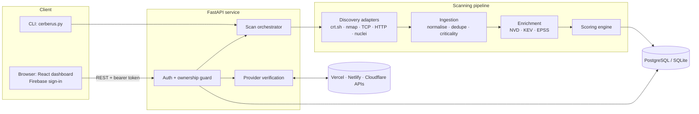
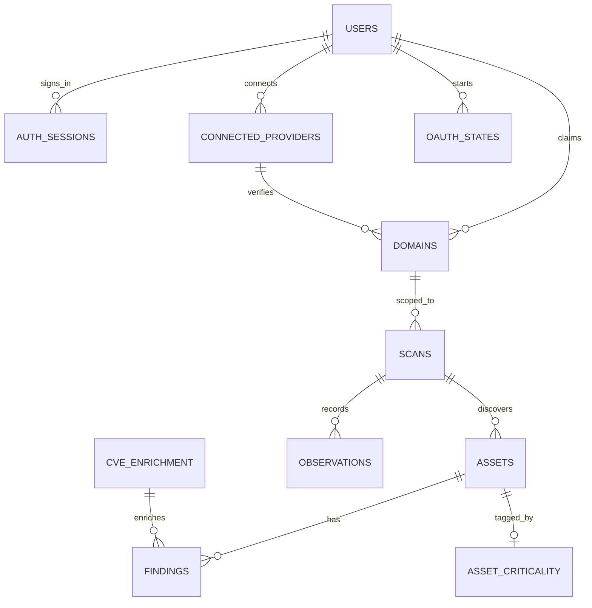

# Cerberus — Project Report

**Continuous Attack Surface & Exploitability Intelligence**
Author: Shivam Bhadane · Built September 2026 · Portfolio / coursework project · State as of 21 September 2026

> **How to use this document.** It is written to be turned into a presentation. Every `##` section is one
> slide group; tables and diagrams can be lifted straight onto slides; [§16](#16-suggested-slide-outline)
> is a ready 16-slide outline with talking points. Every number here was measured from this repository
> (test runs, code counts, a real lab scan). Where something is **not** proven, it says so in
> [§12](#12-limitations-and-known-issues) rather than being left out.

---

## 0. One-slide summary

**Cerberus takes a domain and answers one question: *"Of everything exposed and vulnerable, what are
attackers most likely to exploit first?"***

It discovers internet-facing assets, finds vulnerabilities on them, checks each one against real-world
exploitation data (CISA KEV, EPSS), and produces a **ranked, explainable** list, so a security team knows
what to fix first instead of drowning in a flat list of thousands of findings.

| | |
|---|---|
| **Core idea** | Severity is not danger. A 9.8 nobody exploits ranks below a 9.1 under active attack. |
| **Safety idea** | Nothing is scanned until the user *proves* they own it (DNS record, or a connected Vercel / Netlify / Cloudflare account). |
| **Size** | ~8,400 lines of backend Python, ~4,400 lines TypeScript/React, ~6,500 lines of tests, ~4,200 lines of docs |
| **Quality** | 686 automated tests (681 pass, 5 opt-in), ~120 browser checks, schema verified on SQLite and PostgreSQL 16 |
| **Proven on** | A real lab scan (136 findings, 0 duplicates), live Netlify OAuth, live Vercel access token |

---

## 1. Problem

Every organization with an internet presence faces three compounding problems:

1. **Unknown exposure.** Servers are spun up and forgotten, test environments stay online, shadow IT sits
   outside any inventory. *You cannot defend what you do not know exists.*
2. **Alert overload.** Scanners report *volume*, not *priority*. A scan returns thousands of findings; a team
   can fix a handful per week. Generic severity (CVSS) does not say where to start.
3. **Severity ≠ real-world danger.** A vulnerability scored 9.8 may never be touched by an attacker, while a
   6.5 may be under mass exploitation by ransomware groups today. Static scores miss what is happening
   *now*, so teams patch the wrong things first.

**Net result:** limited security time is spent on low-risk issues while actively-exploited weaknesses stay open.

**A second, less obvious problem: scanning tools are dangerous.** A tool that will scan *any* domain a user
types is an attack tool. Any real product must answer *"who is allowed to scan what?"* before it scans
anything. Most student projects skip this; Cerberus treats it as a core requirement.

---

## 2. Objectives and scope

**Goals**

| # | Goal |
|---|---|
| G1 | Given one domain, produce a ranked list of exploitable exposures with a plain-English reason for each rank |
| G2 | Make ranking reflect real exploitation likelihood (KEV + EPSS), not just CVSS |
| G3 | Keep every pipeline stage independently testable and replaceable |
| G4 | Run end-to-end on free, open data: no paid API keys required |
| G5 *(added during the build)* | Make scanning safe by construction: proven ownership, per-user isolation, a safety floor that cannot be lifted |

**Explicit non-goals (v1):** exploit/weaponization tooling; internal/on-prem scanning; an ML scoring model;
multi-tenant SaaS with billing; real-time continuous monitoring.

**Target users:** security analysts asking "what do I patch this week?"; students and portfolio reviewers who
need a complete, documented example of an attack-surface-management pipeline; authorized pentesters.

---

## 3. Solution

**Input → Output, in one line**

`example.com`  →  a ranked, explainable list of exploitable exposures.

**Four kinds of data that are normally siloed in separate tools, fused into one ranking**

| Data | Tells you | Source |
|---|---|---|
| Asset data | What you actually expose | crt.sh, nmap, TCP connect, HTTP probing |
| Vulnerability data | What is wrong with each asset | nuclei detections + NVD CVE/CPE matching |
| Exploit & threat intel | Whether attackers use it *right now* | CISA KEV, EPSS (FIRST.org) |
| Asset criticality | Whether it is a crown jewel or a forgotten test box | hostname/port heuristics + manual override |

**The pipeline**

```
1. Discovery   →  2. Ingestion   →  3. Enrichment   →  4. Scoring   →  5. Delivery
   what is         normalise &       exploited in        how dangerous      dashboard,
   exposed?        de-duplicate      the wild?           for YOU?           REST API, CLI
```

**The key result: exploitation beats severity.** From the real lab scan:

| CVE | CVSS (severity) | Actively exploited (KEV) | EPSS | **Cerberus score** |
|---|---|---|---|---|
| CVE-2024-38475 | 9.1 | **yes** | ~100% | **83.1** |
| CVE-2021-44790 | **9.8** (higher) | no | 97% | **61.8** |

The *lower*-severity flaw ranks 21 points higher because attackers are using it. That is the whole product.

**Everything is explainable.** Every score ships with a reasoning string, for example:
*"Actively exploited (CISA KEV, added 2021-11-03); 100% predicted exploitation probability (EPSS);
high-criticality asset; internet-facing web service on port 443."*

---

## 4. Architecture

### 4.1 System overview



### 4.2 Design principles

- **Each stage is independently replaceable.** Scoring can evolve from a formula to a learned model without touching discovery.
- **Enrichment data is global.** CVE/KEV/EPSS are identical for everyone: cached once, not per scan or per user.
- **Everything is explainable.** No bare number: every score carries its reasons.
- **Safe by construction.** Authorization, scope and the safety floor are code, not documentation.
- **Provenance on every fact.** Each observation records *which tool* saw it and how (`active_detection` vs `version_inference`).

### 4.3 The ownership model (the security architecture)

A scan is allowed only if **all** of these hold (`core/ownership.py`): the caller is an active user, they own
the domain, the domain is **verified**, and the target is inside it. There is no `authorized: true` flag to send.

```
Claim a domain ──► Verify ownership ──► Scan
                     │
        ┌────────────┴─────────────┐
   DNS TXT record            Platform account (OAuth / token)
   (any domain)              (*.vercel.app · *.netlify.app · *.pages.dev)
```

- **DNS TXT:** publish `_cerberus-challenge.<domain>` with a secret token: only someone controlling DNS can.
- **Deployment platforms:** for apps on free platform addresses (where you cannot add DNS records), connect the
  account and Cerberus asks the platform whether that account controls the project.
- **First to prove owns it:** a partial unique index means only one user can hold a *verified* claim.
- **Re-checked at scan time:** platform names are released when a project is deleted, so a stale proof must not
  authorise a scan. Cerberus asks the platform again before each scan.

### 4.4 Data model (13 tables, 8 migrations)



`tenants`, `users`, `auth_sessions`, `domains`, `connected_providers`, `oauth_states`, `scans`, `assets`,
`asset_criticality`, `observations`, `findings`, `cve_enrichment` (global), `source_refresh`.

### 4.5 Deployment

Docker Compose: `postgres:16-alpine` + an API image with `nmap` and a hash-pinned `nuclei` baked in, running
as an unprivileged user. The dashboard is a static Vite build. SQLite is used for zero-setup local runs.

---

## 5. Tech stack

| Layer | Technology | Why |
|---|---|---|
| Backend / API | **Python 3.11+ (built on 3.14), FastAPI, Pydantic 2, Uvicorn** | Typed request/response models, automatic OpenAPI docs |
| Database | **PostgreSQL 16** / **SQLite**, **SQLAlchemy 2**, **Alembic** | Same models on both; every schema change is a tested migration |
| Discovery | crt.sh, `subfinder`, async TCP connect, **nmap 7.95**, HTTP/banner probing | Interchangeable scanner *adapters*: a tool is a plug-in |
| Detection | **nuclei v3.11.1** (4,754 of 13,619 templates under the default profile) | Real active detection, not only version guessing |
| Threat intel | **NVD**, **CISA KEV**, **EPSS (FIRST.org)** | Free, authoritative, no paid keys |
| Scoring | Pure Python module | Importable, independently testable |
| Authentication | **Firebase Auth** (Google / GitHub / email) + local **Argon2id** login, **JWT**, rotating refresh tokens | Real identity; legacy path kept for the CLI and tests |
| Secrets | **Fernet** (`cryptography`) encryption at rest | Provider tokens are credentials for someone else's cloud |
| Frontend | **React 18, TypeScript 5, Vite 6**, hand-written CSS design system | ~4,400 lines, no UI library, WCAG 2.1 AA target |
| Testing | **pytest** (686), **ruff**, **Playwright** + **axe-core** (~120 browser checks) | Backend, lint, real-browser and accessibility |
| DevOps | **Docker Compose**, `run.sh` (one-command setup/start/stop), local HTTPS helper | One command to run everything |

---

## 6. Methodology

**Build order: thin vertical slices, each working before the next began.**

1. **Foundation first.** Problem statement, PRD, API contract, database schema and Rules of Engagement were written
   *before* code, so scope was decided on paper. Non-goals were as important as goals.
2. **MVP pipeline end to end.** Discovery → ingestion → enrichment → scoring → CLI, each stage with a typed
   input and output, proven against a lab target before adding a UI.
3. **Rebuild for real targets.** Moving from "runs against a lab" to "safe against infrastructure you don't own"
   forced a rewrite: scope-as-code, scanner adapters, scan profiles, provenance.
4. **Accounts and ownership.** The product moved from single-operator to per-user, with proven domain ownership.
5. **Dashboard, then providers, then labs.** UI on a stable API; deployment-provider verification; a Test Labs
   screen with sanctioned targets.

**Verification methodology: prove it against ground truth, not fixtures.**

- **Ground-truth validation.** Two Apache containers (2.4.49, 2.4.50) with known CVEs. Exploitability was
  established independently with `curl`, *then* compared to what Cerberus reported.
- **Real tools, not mocks.** nmap and nuclei ran for real; fixtures were captured from their real output.
- **Measured from the target's side.** The rate limit was verified from the containers' access logs
  (17.8 req/s observed vs a 20 limit), not from the scanner's own report.
- **Two databases.** Every migration was run up → down → up on SQLite and PostgreSQL 16, with seeded data, and
  compared against the models: *"no differences"* is asserted by a test.
- **Adversarial tests.** Cross-user access, forged and replayed OAuth state, malformed input, and "can a
  removed project still authorise a scan?" each have tests whose only job is to *try to break the rule*.
- **Security review of the auth path.** Found two real vulnerabilities (see §9).
- **Accessibility audit.** axe-core on every screen state, plus manual keyboard checks.

**Scoring methodology.** A transparent weighted blend, weights in `config.yaml`:

| Signal | Weight | Meaning |
|---|---|---|
| KEV status | 0.35 | Is it being exploited in the wild right now? |
| EPSS | 0.25 | Probability of exploitation in the next 30 days |
| Asset criticality | 0.25 | How much do we care about the affected system? |
| Exposure context | 0.15 | How reachable is it, and how much does the flaw grant? |

CVSS is **deliberately not a top-level weight**; it enters only through exposure context. Bands:
critical ≥ 80, high ≥ 60, medium ≥ 40, low below. Detection method is reported in the reasoning but does not
change the score: it measures confidence the weakness exists, not how dangerous it is.

---

## 7. Implementation highlights

| Area | What was built | The interesting part |
|---|---|---|
| **Scope** (`core/scope.py`) | Authorization boundary as code | Fixed a real hole: `endswith("example.com")` accepted `evilexample.com`. Refuses private, loopback and cloud-metadata (`169.254.169.254`) addresses |
| **Scan profiles** (`core/profiles.py`) | `passive` / `safe` / `thorough` | **Non-overridable safety floor:** DoS, fuzz and brute-force template tags and local-execution protocols are refused at construction, re-audited at adapter entry, and filtered again on results |
| **Adapters** (`core/adapters.py`) | crt.sh, subfinder, tcp_connect, nmap, http_probe, nuclei | Adding a scanner is one file. Every fact records which tool saw it |
| **Ingestion** | Normalise, dedupe, criticality tagging | Re-scans never duplicate; manual criticality always wins over the heuristic |
| **Enrichment** | NVD CPE matching, KEV, EPSS, global cache | The NVD client originally read *one page*; fixed after 19 of 69 CVEs were dropped |
| **Scoring** | Weighted blend with reasoning | Two findings with equal CVSS score differently, and the reasoning says why |
| **API** | 32 endpoints (FastAPI) | Uniform error shape; another user's record answers `404`, identical to a missing one |
| **Auth** | Firebase + local login, Argon2id, JWT, refresh-token rotation with replay detection | A reused refresh token means a copy leaked, so the whole login is revoked |
| **Dashboard** | 8 screens: Overview, Targets, Test Labs, Scans, Findings, Assets, Evidence, Profile | URL-driven filters and sort, keyboard-operable tables, Indian Standard Time display |
| **Providers** | Vercel, Netlify, Cloudflare Pages verification | Authorization-code OAuth, single-use `state` bound to user *and* browser, PKCE, encrypted tokens never sent to the browser |
| **Test Labs** | Docker testbeds + sanctioned public targets | Juice Shop, DVWA, the Apache lab, and Acunetix/IBM public benchmark sites |
| **Tooling** | `run.sh`, hardened Docker image, local HTTPS helper | One command runs everything; the HTTPS CA is name-constrained to `localhost` only |

---

## 8. Work done

### 8.1 Timeline (25 commits, 5 September – 21 September 2026)

| Phase | Deliverable |
|---|---|
| **0. Foundation** | README, PRD, API contract, DB schema, Rules of Engagement, repo scaffold |
| **1. MVP pipeline** | Discovery → ingestion → enrichment → scoring → CLI, end to end |
| **1.5 Real-target validation** | Scope-as-code, scanner adapters, scan profiles with safety floor, provenance, nuclei, Alembic migrations |
| **2. Delivery** | Dashboard, deployment guide, demo script, validation run, accessibility pass |
| **2. Accounts** | Users, sessions, DNS-TXT domain ownership, per-user isolation |
| **2. Profile & shell** | Redesigned dashboard shell, Profile page (Google photo/name), non-link brand, Landing button |
| **2. Providers** | Deployment-provider ownership verification (Vercel, Netlify, Cloudflare Pages) |
| **2. Labs** | Test Labs & Benchmarks screen |

### 8.2 By the numbers

| Measure | Value |
|---|---|
| Python (all) | 14,870 lines: **~8,360 application**, **~6,510 tests** |
| Frontend | ~4,400 lines TS/TSX + ~1,100 lines CSS, 16 components |
| Documentation | ~4,200 lines of Markdown (10 documents in `docs/`, plus the READMEs) |
| API | 32 endpoints (31 in the OpenAPI schema + the OAuth callback) |
| Database | 13 tables, 8 migrations (0001–0008) |
| Automated tests | **686** (681 pass, 5 opt-in public-target tests skipped) in 28 test files |
| Browser tests | ~120 Playwright checks + axe accessibility on every screen state |
| Dependencies | 0 known vulnerabilities in the frontend production tree (`npm audit`) |

### 8.3 Deployment-provider work (the largest late feature)

- `providers/` abstraction: one module per platform behind a common contract that enforces two shared rules
  once: **only platform hostnames prove anything** (a custom domain "listed on a project" proves nothing), and
  **browser-supplied ids are validated before they enter a URL**.
- **Vercel:** OAuth *integration*, plus a **pasted-access-token fallback** built when the integration could not be
  installed. **Netlify:** OAuth. **Cloudflare Pages:** OAuth with PKCE.
- `connected_providers` and `oauth_states` tables; tokens Fernet-encrypted and bound to their row.
- Local **HTTPS mode** (`./run.sh https`) so providers that refuse `http://` redirect URLs can be used.

---

## 9. Results and validation

### 9.1 The real lab scan

| | |
|---|---|
| Targets | Apache 2.4.49 and 2.4.50 (Docker, loopback) |
| Tools | nmap 7.95, nuclei v3.11.1, TCP connect. **No tool errors** |
| Assets | 2, both identified by nmap |
| **Findings** | **136** (69 + 67); **0 duplicate** (asset, CVE) rows |
| KEV-listed | 5 |
| Duration | 802 s at the 20 req/s profile limit |
| Rate limit, from the target's logs | 17.8 req/s combined (limit 20) |

**Precision held.** CVE-2021-41773 is fixed in 2.4.50, and Cerberus correctly reported it on 2.4.49 only.
**Both evidence types were kept and labelled** because active detection confirmed 1 of the 3 real (asset, CVE)
pairs while version inference correctly flagged the one nuclei's template missed.

### 9.2 What validation found wrong (19 bugs, each with a regression test)

| Highlights | Why it matters |
|---|---|
| nuclei **hung forever** when stdin was inherited, then returned "no detections" as if it found nothing | A tool failure must never look like "found nothing" |
| **VARCHAR(128) crashed enrichment on PostgreSQL** with a real 179-character KEV field; SQLite never enforced the limit | Every local test passed while production would have crashed |
| NVD client read **one page**: 19 of 69 CVEs dropped | Any could have been KEV-listed |
| The `passive` profile **still port-scanned** | Behaviour contradicted its documentation |
| `init_db.py` **printed the database password**; no `.dockerignore` would have baked `.env` into the image | Secrets hygiene |
| Every timestamp was wrong by the viewer's UTC offset ("6 h ago" for a scan started a minute ago) | Data correct, display wrong |

### 9.3 Security findings in the authentication path

| Finding | Fix |
|---|---|
| **Authentication bypass:** synthetic `test-firebase-token:<email>` tokens (for tests) were honoured in every deployment. Anyone who could type an email address became that user | Honoured only when `CERBERUS_ALLOW_TEST_TOKENS=1`; the API logs an error if set outside tests |
| **Account takeover:** an *unverified* sign-up with someone else's email was linked to their existing account | Verified email may link; unverified gets `401 email_not_verified` |
| Test found a bare `team_` accepted as a Vercel team ID | Tightened, with its own error message |

### 9.4 Provider verification proven against live services

| Provider | Method | Status |
|---|---|---|
| **Netlify** | OAuth | **Working live.** Real connection; a `*.netlify.app` site verified through it |
| **Vercel** | Access token | **Working live.** Real account read (4 projects); `spacehunt-five.vercel.app` verified |
| Vercel | OAuth integration | Blocked by Vercel's console (redirect-URL and visibility issues); token path built instead |
| **Cloudflare** | OAuth (PKCE) | Built and tested against fakes; **not yet proven live** (client creation in progress) |

---

## 10. Security and ethics

- **Authorization is proven, not asserted.** No `authorized: true` field exists in the API.
- **Per-user isolation everywhere.** Another user's record is a `404`, indistinguishable from a missing one.
- **OAuth done carefully:** authorization-code flow; random single-use `state` bound to user and browser; PKCE;
  exact redirect URI built server-side; a provider's `401` never becomes Cerberus's own `401`.
- **Tokens:** Fernet-encrypted, bound to their row, never returned by any endpoint, never logged.
- **Re-verification at scan time** so a deleted-then-reclaimed project name cannot authorise a scan.
- **Safety floor:** dangerous scan categories cannot be enabled by any configuration.
- **Rate limits** on sign-in, DNS verification and provider calls.
- **Legal and ethical:** detection and prioritization only; no exploitation. Rules of Engagement are enforced in code.

---

## 11. Demo script (about 5 minutes)

1. **Sign in** with Google → **Profile** shows name and photo from the verified token.
2. **Targets:** add a custom domain → the DNS TXT record to publish; show a *pending* domain **cannot** be scanned.
3. **Targets → Deployment:** connect Netlify → pick the project → **Add & verify** → verified *via Netlify*, no DNS record.
4. **Test Labs:** add the Apache lab (Docker) as a target.
5. **Scans:** start a `safe`-profile scan; show the profile picker and the opt-in gate for `thorough`.
6. **Findings:** the ranked list; open one to show the **reasoning string**, evidence and confirmed/inferred badge.
7. **The punchline:** a CVSS 9.1 KEV-listed finding **outranking** a CVSS 9.8 non-KEV one.
8. **Evidence:** raw tool output, before normalisation, to show provenance.

---

## 12. Limitations and known issues

Stated plainly, because a reviewer will find them and it is better to have found them first.

**Scope of validation**
- Validated against **two Apache containers** and one public host, not CDNs, WAFs, IPv6 or non-HTTP services.
- nuclei's `safe` profile found **1 detection across 4,754 templates**: a statement about this lab, not nuclei.
- CPE matching is version-string based: distributions that back-port patches will be over-reported.
- Level 3 (own infrastructure with mixed services) has not been attempted.

**Providers**
- **Cloudflare is not yet proven live.** Cloudflare does not publish its Pages scope names, and its console form
  blocked client creation; an API-based setup script exists but has not completed.
- Vercel OAuth is blocked; Vercel access tokens are **broader than read-only** (Vercel has no read-only token).
- Only free platform addresses (`*.vercel.app`, `*.netlify.app`, `*.pages.dev`) can be verified this way.

**Open issues found in the final end-to-end review**
1. **Loopback scan scope is too broad.** The Test Labs feature makes `127.0.0.1` verifiable by any signed-in user
   and enables all private ranges for that target. Harmless on a laptop, **unsafe if hosted**. Two docs still claim
   loopback is impossible.
2. **A helper script records false provenance** (`dns_txt` for testbed targets that never had a DNS check).
3. **The Test Labs screen has 3 accessibility violations** (contrast 2.09:1 on flaw pills, heading order,
   non-focusable code blocks), contradicting the "zero violations" claim.
4. 16 lint errors and 3 stale browser-test assertions.

**Architectural limits:** scans run in-process (a restart interrupts them); enrichment refresh is scheduled, not
streamed; scoring weights are hand-tuned, not learned; no email verification or password reset in the local login.

---

## 13. Conclusion

Cerberus demonstrates that **prioritising by real-world exploitation, not theoretical severity, is achievable
with free, open data**, and that a scanner can be built so that misuse is **structurally hard** rather than
merely discouraged.

- The **ranking works and is explainable**: a lower-severity, actively-exploited flaw outranks a
  higher-severity, unexploited one, with the reasons written out.
- The **pipeline is measured, not asserted**: a real lab scan against independently-established ground truth, a
  rate limit verified from the target's side, 0 duplicates, 19 real bugs found and fixed with regression tests.
- The **security model is the differentiator**: ownership proven by DNS or by a platform account, re-checked at
  scan time, isolated per user, with a safety floor no configuration can lift. Reviewing it found two real
  authentication vulnerabilities, which were fixed.
- **Honest scope.** What is proven live (Netlify, Vercel), what is not (Cloudflare), and what is still wrong
  (§12) are all stated.

**What was learned.** Local tests pass while production fails (PostgreSQL vs SQLite); a tool failure must never
look like "no findings"; documentation drifts from code unless something checks it; and *security review of your
own code finds real bugs*.

---

## 14. Future scope

**Near term (fix what the review found)**
- Narrow the loopback scope to `127.0.0.1` only and correct the two docs.
- Record `testbed` provenance correctly; fix the Test Labs accessibility violations; clear lint.
- Finish Cloudflare live verification; keep Vercel on tokens or fix its integration.

**Product**
- **Continuous monitoring:** scheduled re-scans with a *diff between scans* (new / fixed / regressed).
- **Slack / Jira** alerts and ticket creation for new critical findings.
- **Email verification, password reset, "sign out everywhere".**
- **Revoke provider tokens** at the platform on disconnect; continuous re-verification, not only at scan time.
- More platforms (GitHub Pages, Render, Fly.io, Railway): each is one module.

**Platform**
- **Async worker queue** (Redis Streams, then Kafka) so scans survive restarts and scale out.
- **Cloud connectors** (AWS / Azure / GCP asset inventory) to find assets DNS never reveals.
- **Organisations / teams** sharing domains; row-level security for real multi-tenancy.
- **Kubernetes** deployment.

**Intelligence**
- **Graph-based blast-radius analysis** (Neo4j): "if this host falls, what can it reach?"
- **Learned scoring model** trained on confirmed-exploit outcomes, replacing hand-tuned weights.
- Dependency scanning with **OSV.dev**; premium feeds (GreyNoise, VulnCheck) as optional upgrades.
- A public API for MSSP / partner use.

---

## 15. Appendix

### 15.1 Repository map

```
cerberus/
├── core/         config · DB · models · pipeline · scope · scan profiles · adapters · security · crypto · provider service
├── discovery/    orchestration + adapters: crt.sh, subfinder, tcp_connect, nmap, http_probe, nuclei
├── ingestion/    normalisation, dedupe, criticality tagging
├── enrichment/   CVE / KEV / EPSS pullers, cache, technology→CVE matching
├── scoring/      exploitability engine
├── providers/    Vercel · Netlify · Cloudflare Pages verification
├── api/          FastAPI: auth · domains · scans · findings · providers
├── migrations/   Alembic 0001–0008
├── frontend/     React + TypeScript dashboard (and landing page), Playwright e2e
├── lab/          intentionally vulnerable Docker targets
├── tests/        686 tests
├── scripts/      init_db · refresh_enrichment · local_https · setup helpers
├── docs/         PRD · API · schema · RoE · roadmap · deployment · validation · demo · code map · this report
└── run.sh        one command to set up, start, stop and test everything
```

### 15.2 Run it

```bash
./run.sh            # set up if needed, start API + dashboard
./run.sh https      # serve over https://localhost (for providers that require it)
./run.sh test       # tests, lint and the dashboard build
```

### 15.3 Glossary (for the audience)

| Term | Meaning |
|---|---|
| **CVE** | A public identifier for a specific vulnerability |
| **CVSS** | Theoretical severity score, 0–10 |
| **KEV** | CISA's catalogue of vulnerabilities *confirmed exploited in the wild* |
| **EPSS** | Probability a CVE will be exploited in the next 30 days |
| **ASM** | Attack surface management |
| **Provenance** | Recording which tool saw a fact, and how |
| **OAuth** | A way to let one service act for you at another without sharing your password |

### 15.4 Related documents

[README](../README.md) · [PRD](PRD.md) · [API](API.md) · [Database schema](DATABASE_SCHEMA.md) ·
[Rules of Engagement](RULES_OF_ENGAGEMENT.md) · [Roadmap](ROADMAP.md) · [Deployment](DEPLOYMENT.md) ·
[Validation](VALIDATION.md) · [Demo](DEMO.md) · [Code map](code.md)

---

## 16. Suggested slide outline

| # | Slide | Key content (from this document) | Visual |
|---|---|---|---|
| 1 | **Title** | Cerberus: Continuous Attack Surface & Exploitability Intelligence | Logo (`frontend/public/assets/cerberus-logo-black.svg`) |
| 2 | **The problem** | Unknown exposure · alert overload · severity ≠ danger (§1) | Three icons |
| 3 | **Why existing tools fall short** | Volume, not priority; and the unspoken problem: who may scan what? | Before/after |
| 4 | **Objectives and scope** | Goals G1–G5, explicit non-goals (§2) | Table |
| 5 | **The solution** | Domain in, ranked explainable list out; four fused data sources (§3) | Input → output arrow |
| 6 | **The key result** | CVSS 9.1 KEV **outranks** CVSS 9.8 non-KEV (83.1 vs 61.8) | Two-bar comparison |
| 7 | **Architecture** | Five-stage pipeline + storage + API (§4.1) | The mermaid diagram |
| 8 | **The ownership model** | Claim → verify (DNS or platform) → scan; re-checked at scan time (§4.3) | Flow diagram |
| 9 | **Tech stack** | Table from §5 | Logos |
| 10 | **Methodology** | Slices, ground-truth validation, adversarial tests, two databases (§6) | Timeline |
| 11 | **Scoring** | Four weights; "severity is not danger" (§6) | Pie/stacked bar of 35/25/25/15 |
| 12 | **What was built** | 8,400 lines Python, 4,400 TS, 32 endpoints, 13 tables, 686 tests (§8.2) | Number cards |
| 13 | **Results** | 136 findings, 0 duplicates, 17.8 req/s measured from the target; 19 bugs found (§9) | Tables |
| 14 | **Security** | Two auth vulnerabilities found and fixed; proven live on Netlify + Vercel (§9.3–9.4) | Table |
| 15 | **Limitations, honestly** | §12: what is not proven, what is still open | Two columns: proven / not yet |
| 16 | **Conclusion and future scope** | §13–§14: diffing scans, worker queue, cloud connectors, blast radius, learned scoring | Roadmap |

**Speaker tip.** Slide 6 is the one to spend time on: put the two CVEs side by side and let the audience guess
which ranks higher before revealing it. Slide 15 will earn more credibility than any other; do not skip it.
